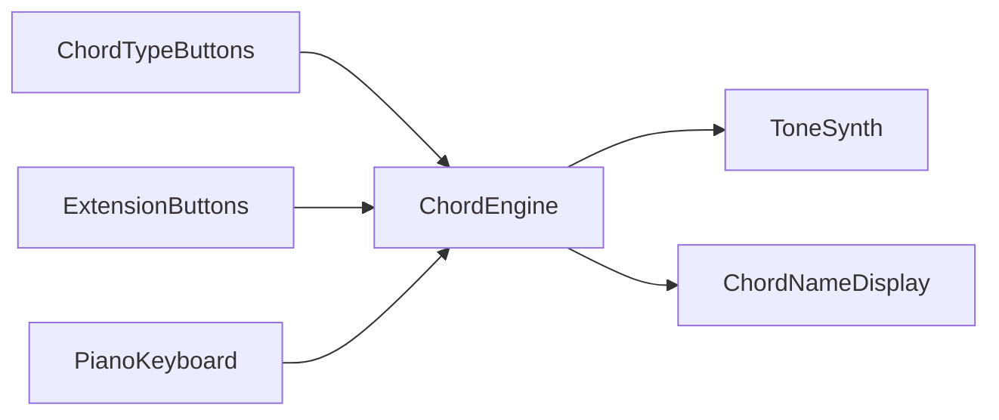

# Chord Generator MVP

## Scope

Build **version A**: chord engine only — one-octave piano keyboard, 8 chord buttons, Web Audio poly synth, and chord name readout. No voicing dial, Key Mode, bass, effects, looper, or performance modes in this pass.

Hold a chord type (and optional extensions), press a root key, hear the chord.

## Project setup

1. Create `~/Github/chord-generator` with Vite+:
   ```bash
   vp create vite --directory ~/Github/chord-generator --git --no-interactive -- --template react-ts
   ```
2. Call `move_agent_to_root` on that path **before** any app code.
3. Install deps with `vp install`; add Tone.js for reliable polyphonic Web Audio (or use raw Web Audio oscillators if Tone is overkill — prefer **Tone.js** for envelopes/polyphony with less glue).

## Interaction model



- **Hold** one chord type: Dim / Min / Maj / Sus (or none → root note only / silence policy: play root only when no type held).
- **Hold** zero or more extensions: 6 / m7 / M7 / 9.
- **Press** a key on a one-octave keyboard (C–B, with black keys) → compute pitch classes from root + intervals → start notes; release key → stop.

Also support **computer keyboard** shortcuts for playability (e.g. A–K style for white keys; Q/W/E… for blacks; number/letter keys for chord buttons) so desktop testing is easy without multitouch.

## Chord engine (pure logic)

New module e.g. `src/music/chords.ts`:

| Type | Intervals (semitones from root) |
| ---- | ------------------------------- |
| Maj  | 0, 4, 7                         |
| Min  | 0, 3, 7                         |
| Dim  | 0, 3, 6                         |
| Sus  | 0, 5, 7 (sus4)                  |

| Extension | Adds             |
| --------- | ---------------- |
| 6         | +9               |
| m7        | +10              |
| M7        | +11              |
| 9         | +14 (2 + octave) |

Combinations match the manual examples (Maj+M7 → maj7, Maj+m7 → dominant 7, Dim+m7 → dim7, etc.). Export `buildChord(rootMidi, types, extensions) → midiNotes[]` and `formatChordName(...) → string` (e.g. `Cmaj7`, `Am7`, `G7`).

Unit-test a few combinations with Vitest (`vp test`).

## UI layout (single composition)

Desktop-first panel inspired by the hardware, not a pixel-perfect clone:

- **Left:** 2×4 button grid — top row types, bottom row extensions; pressed = held state.
- **Right:** one-octave piano (click/touch pointer events with proper press/release).
- **Top/center:** large current chord name + optional note list.
- Visual direction: warm instrument aesthetic (cream/black panel feel), expressive typography — avoid generic purple/dashboard look. One clear play surface.

Key files:

- `src/App.tsx` — layout shell
- `src/components/ChordButtons.tsx`
- `src/components/PianoKeyboard.tsx`
- `src/components/ChordDisplay.tsx`
- `src/audio/synth.ts` — Tone.js PolySynth wrapper (start on first user gesture)
- `src/music/chords.ts` — theory

## Audio

- Lazy-init AudioContext / Tone on first pointer/key interaction (browser autoplay policy).
- Simple polyphonic pad/keys voice (saw/triangle + short attack/release) — enough to judge chords.
- Master volume control (small slider).

## Done when

- Holding Maj + pressing C plays C major; Maj+m7+C plays C7; Min+m7+A plays Am7, etc.
- Chord name updates live.
- Mouse and touch work for buttons and keys; basic QWERTY shortcuts work.
- `vp dev` runs; `vp check` / `vp test` pass for chord logic.
